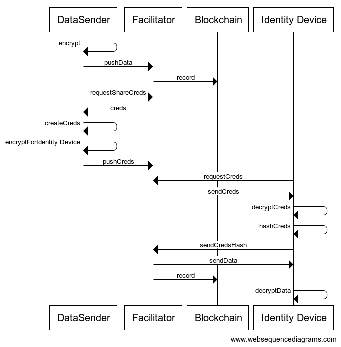

 
# ReCheck SDK 

This repository contains a **summary of the encryption protocol** ReCheck developed and afterwars **links to the tools** implementing this protocol with a bit of description. We believe this will help you to choose which one is going to be the most useful for you and **continue to the tool's repository where more detail** can be found. 

## Overview of our encryption protocol

ReCheck developed an end-to-end encryption protocol for secure data interaction and transfer.

Using the protocol, users can encrypt, decrpyt data and exchange it safely by providing the blockchain ID of the recepient. The protocol involves symmetric and asymmetric encryption to achieve a lightweight authentication process through devices such as smartphones. However, the protocol can be used for end-to-end encryption and data tracking by other type of devices such as the ones of IoT nature as far as they can hold a key pair and are connected to the internet.

The user can upload, open or share data using another device without the need to expose their private key from the identity device. The protocol also ensures that the data is never sent in a decrypted (vulnerable) state. 

We decided to create some tools implementing this protocol and share them with the world.

## Table of Contents
 - [ReCheck SDK Components](#recheck-sdk-components)
    - [JavaScript Client Library](#javascript-client-library)
    - [Node CLI Tool](#node-cli-tool)
    - [Java Client Library](#java-client-library)
    - [Vue Blockchain Authorizer](#vue-blockchain-authorizer-components-and-app)
    - [Mobile Webapp](#mobile-webapp)
    - [Blockchain verifier](#blockchain-verifier)

## ReCheck SDK Components

### JavaScript Client Library 
The [JS implementation](https://github.com/ReCheck-io/recheck-clientjs-library) of the protocol in JavaScript, being the backbone of the SDK, it is then used in the rest of the tools. You can [check it out here](https://github.com/ReCheck-io/recheck-clientjs-library) and have a look at the [documentation](https://github.com/ReCheck-io/recheck-clientjs-library/blob/master/docs/index.md) for more details.

### Node CLI Tool 
The CLI tool, [hammer](https://github.com/ReCheck-io/hammerJS), is exploring the functionality of the library. You can use it to connect to our test environment - https://beta.recheck.io and upload, download, sign or share files with your friends. You can [check it out here](https://github.com/ReCheck-io/hammerJS) and have a look at the [documentation](https://github.com/ReCheck-io/hammerJS/blob/master/docs/index.md) for more details.

### Java Client Library
The Java implementation ([HammerJ](https://github.com/ReCheck-io/hammerJ)) of the protocol. It exports the same core functions/methods as the JS library i.e. to upload, download, sign and share. You can [check it out here](https://github.com/ReCheck-io/hammerJ).

### Vue blockchain authorizer components and app

A set of Vue.js [components](https://github.com/ReCheck-io/vue-recheck-authorizer) for authentication and data interaction with Recheck Platform and [test app](https://github.com/ReCheck-io/vue-recheck-authorizer-app).

Recheck Authorizer comes with built-in wallet creation/loading, encrypt/decrypt or sign data on the platform, password validation, styling and error handling. This means you spend less time maintaining the code, all while building a secure connection with Recheck.

The package minimizes developer's effort to integrate and handle secure connection with the platform.

You can [check it out here](https://github.com/ReCheck-io/vue-recheck-authorizer) and have a look at the [documentation](https://recheck-io.github.io/vue-recheck-authorizer/guide.html) for more details.

We provide also a test application for the autorizer. You can [check it out here](https://github.com/ReCheck-io/vue-recheck-authorizer-app).

### Mobile webapp 
This [application](https://github.com/ReCheck-io/recheck-mobile-webapp) can be used as a mobile user token for authentication and signing of transactions on the blockchain. It provides wallet management and includes a QR scanner which helps the user to execute transactions on the browser side. You can use the application with our test environment https://beta.recheck.io. Using this application the private keys of the user never leaves the device. 

You can [check it out here](https://github.com/ReCheck-io/recheck-mobile-webapp).

### Blockchain verifier

This [application](https://github.com/ReCheck-io/recheck-verifier) can verify if a transaction - share, upload, or open has been made. Where open is when the shared file has been decrypted for the first time by the recepient. At this moment the verification of data can be done on information that exist on our test environment - https://beta.recheck.io. 

You can [check it out here](https://github.com/ReCheck-io/recheck-verifier).