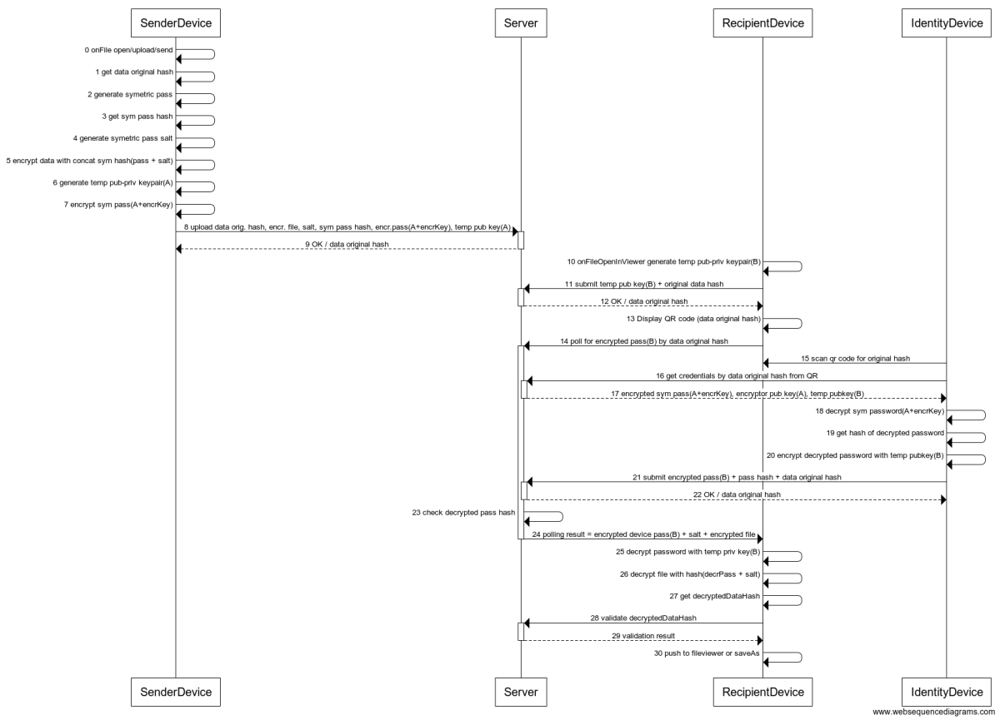

# ReCheck SDK 

ReCheck invented an end-to-end encryption protocol for secure data: transfer, fetching, storage and validation. We decided to create some tools implementing parts of this protocol and share them with the world. 

## Table of Contents
 - [What can Recheck give you](#what-can-recheck-give-you)
    - [JavaScript Client Library](#javascript-client-library)
    - [Node CLI Tool](#node-cli-tool)
    - [Java Client Library](#java-client-library)
    - [Vue Blockchain Authorizer](#vue-blockchain-authorizer)
    - [Mobile Webapp](#mobile-webapp)

## What can ReCheck give you 

### JavaScript Client Library 
The [JS implementation](https://github.com/ReCheck-io/recheck-clientjs-library) of the protocol in JavaScript, being the backbone of the SDK, it is then used in several of the other tools. You can check it out [here](https://github.com/ReCheck-io/recheck-clientjs-library) and have a look at the [documentation](https://github.com/ReCheck-io/recheck-clientjs-library/blob/master/docs/index.md)

### Node CLI Tool 
The CLI tool, [hammer](https://github.com/ReCheck-io/hammerJS), is exploring the functionality of the library. You can use it to connect to our test environment - https://beta.recheck.io and upload, download, sign or share files with your friends. Check it out [here](https://github.com/ReCheck-io/hammerJS) and have a look at the [documentation](https://github.com/ReCheck-io/hammerJS/blob/master/docs/index.md) for more details.

### Java Client Library
The Java implementation (HammerJ) of the protocol. It exports the same core functions/methods as the JS library i.e. to upload, download, sign and share. You can check it out [here](https://github.com/ReCheck-io/hammerJ).

### Vue blockchain authorizer

A set of Vue.js components for authentication and data interaction with Recheck Platform.

Recheck Authorizer comes with built-in wallet creation/loading, encrypt/decrypt or sign data on the platform, password validation, styling and error handling. This means you spend less time maintaining the code, all while building a secure connection with Recheck.

The package minimizes developer's effort to integrate and handle secure connection with the platform.

You can check it out [here](https://github.com/ReCheck-io/vue-recheck-authorizer).

### Mobile webapp 
A webapp application that is developed especially for running on the receiving device - check the protocol.It can connect to our test environment https://beta.recheck.io. This webapp is constructed to hold the private keys of the user. As such this application has a premise to be used on the mobile phone. By doing this the users will most likely to always have their keys with them. Check it out [here](https://github.com/ReCheck-io/recheck-mobile-webapp).

